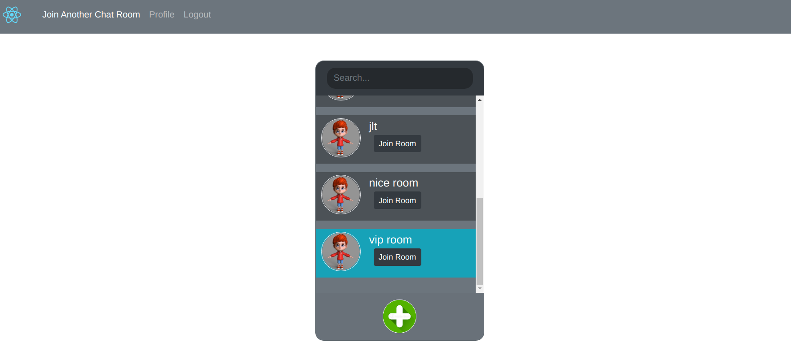
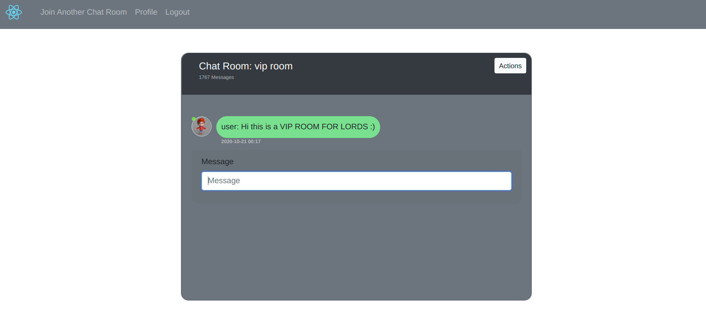
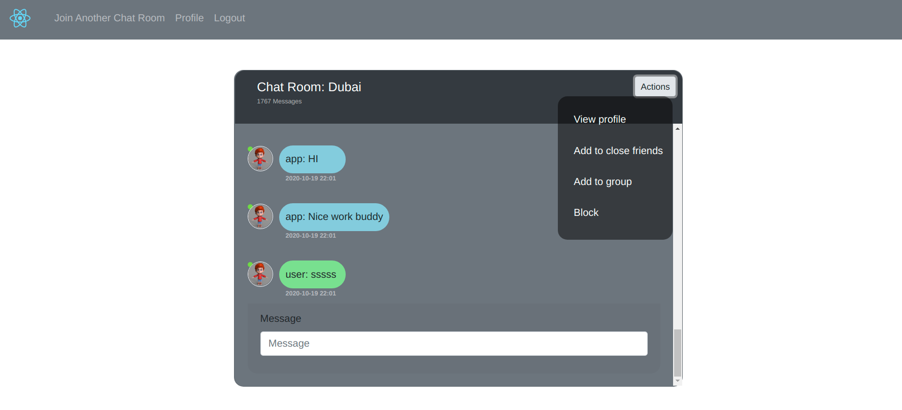

# MERN Stack Room Chat App

Steps to up this awesome app.

## Run Backend Node.js Server

1. cd mern-stack-room-chat-app/server

2. npm install

3. npm start app.js

## Run front React.js web app

1. cd mern-stack-room-chat-app/web-app

2. npm install

3. npm start

## Visit the frontend
1. http://localhost:3000

### ENJOY CODING :)

 

